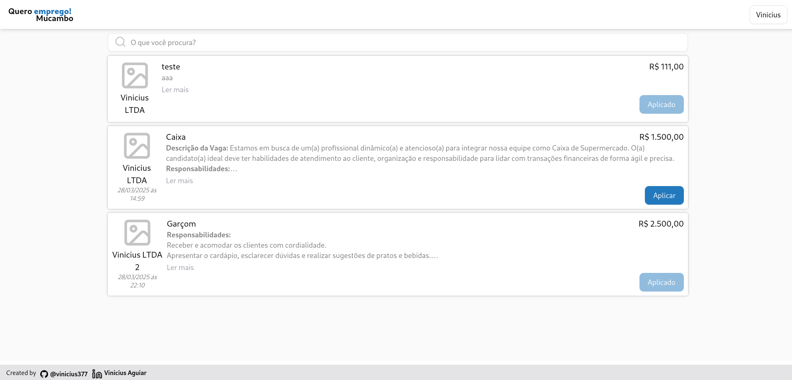
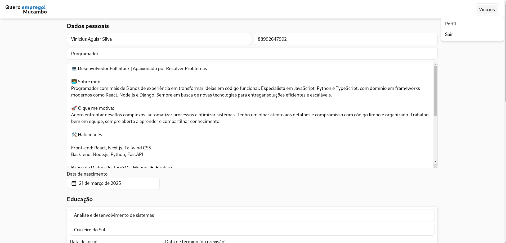
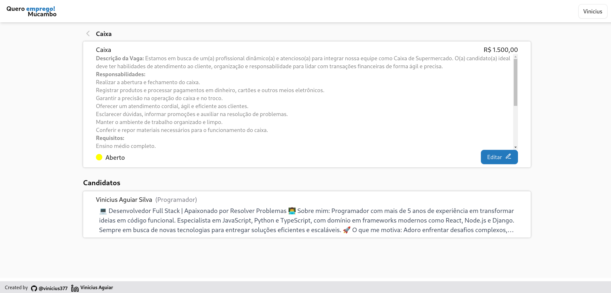
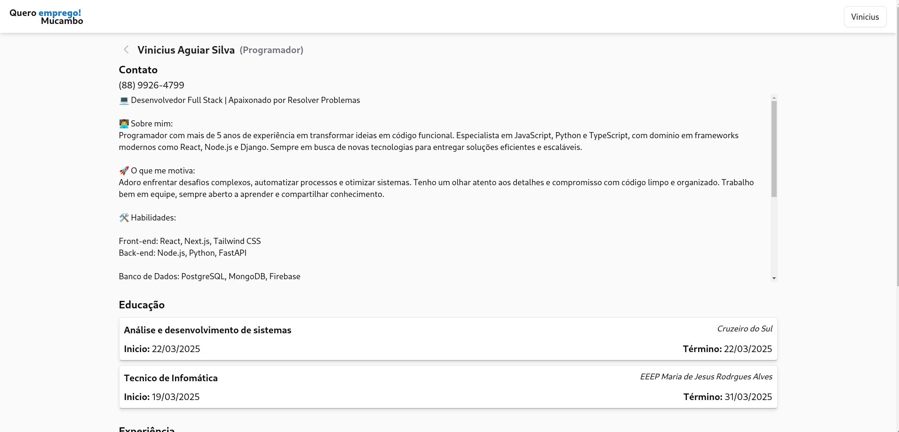

# Quero Emprego - Mucambo

Site para busca de empregos, na cidade de Mucambo 💼🤝🏽

<table>
    <tr>
        <td>
            
            Tela inicial
        </td>
        <td>
            
            Tela de perfil
        </td>
    </tr>
    <tr>
        <td>
            
            Tela de detalhes do emprego
        </td>
        <td>
            
            Tela do Candidato
        </td>
    </tr>
</table>

## Features
Geral
- [x] Fazer o login, para empresas e candidatos
- [x] Fazer o cadastro, de empresas e candidatos

Empresas
- [x] Empresas podem criar novos posts de vagas de emprego
- [x] Empresas tem acesso a todos os posts, podendo alterar suas informações
- [x] Empresas podem mudar o status da vaga de emprego
- [x] Empresas tem acesso aos candidatos e suas informações

Candidatos
- [x] Candidatos podem aplicar as vagas abertas
- [x] Candidatos podem alterar as suas informações

## Tecnologias
Utilizando monorepo, com yarn

### Front-end
- React 
- Rspack
- Jotai
- tRCP
- shadcn

### Back-end
- tRPC
- Mongoose